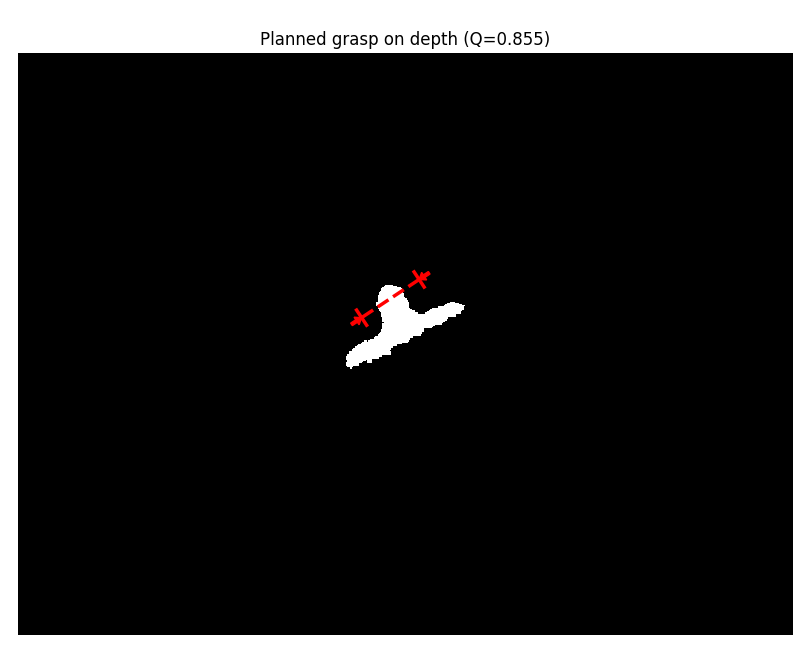

# Description
This repo contains ROS packages in separate branches for testing two grasping algorithms (GPD 2.0.0 and **GQCNN 1.1.0**) on the Kinova Gen3. Specifically, for grasping comparison experiments.
All testing was done on Ubuntu 16.04 w/ ROS Kinetic in Simulation and with a Real workstation. 

Note: this package is in python2 due to compatibility issues with Kinetic and python3.  
For Gen3 setup instructions see the GPD branch.

## Installing Dexnet (Optional: for training new models, gqcnn has already trained models)
1. After many attempts, could only get it working on Ubuntu 18 w/ ROS melodic and python 3.7
1. The official instructions [here](https://berkeleyautomation.github.io/dex-net/install/install.html) did not work for me.
1. Follow this google doc instead: https://docs.google.com/document/d/1YImq1cBTy9E1n1On6-00gueDT4hfmYJK4uOcxZIzPoY/edit?usp=sharing
   1. Make sure you do `sudo apt-get install freeglut3-dev`
1. For CLI instructions see here: https://docs.google.com/document/d/1a9aoDuo-iYG-UyCJPq-ubnyW2Hgnf0YIdYvkp5DlBf0/edit

## Installing GQCNN 1.1.0
To get it working on Ubuntu 16 w/ kinetic, you have to get an old version (1.1.0). Anything after that has python3 code in it.  
[Official Instructions](https://berkeleyautomation.github.io/gqcnn/install/install.html#ros-installation)
1. In your catkin_ws/src: `git clone https://github.com/BerkeleyAutomation/gqcnn.git`
1. Checkout the 1.1.0 release
1. `catkin build`
1. In the package, `python2 setup.py install`
1. `python2 -m pip install requirements/p3/gpu_requirements.txt`
1. Now there are a bunch more things you need that aren't listed. Install the **specified versions** of the following packages from Berkeley. (I've tried many releases, these are the only ones that worked):  
    After cloning each one, `catkin build` to make sure there are no errors.  
   1. [autolab_core](https://github.com/BerkeleyAutomation/autolab_core), v=0.14.0
   1. [perception](https://github.com/BerkeleyAutomation/perception), v=0.0.9  
   1. [visualization](https://github.com/BerkeleyAutomation/visualization) v=0.1.0
1. Then you need to get these pip3 modules. Once again, some need specific versions to work with python2!
    1. ruamel_yaml==0.16.13, colorlog, multiprocess, setproctitle, imagio==2.6.1, trimesh, shapely, pyrender, typing, pyglet==1.4.11, scikit-learn==0.20.4, GPUtil, scikit-image==0.14.5
1. `cd gqcnn/models` and run `download_models.sh` to get the pretrained models. I used GQCNN-4.0-PJ for testing.
1. After everything has been installed`roslaunch gqcnn grasp_planning_service.launch model_name:=GQCNN-4.0-PJ`
    1. You might get a bunch of tensorflow warnings, but it sill works
    1. Deal with any errors that may popup, mostly everything you need is listed above but you may be missing other packages that I already had. 
 1. If you are able to properly run the grasp_panning_service, cd to the gqcnn package and run  
 ```
 python2 examples/policy_ros.py --depth_image data/examples/single_object/primesense/depth_1.npy --segmask data/examples/single_object/primesense/segmask_1.png --camera_intr data/calib/phoxi/phoxi.intr
 ```  
  If you see this, then your installation is all good! You can add your own depth imgs and segmasks to try it out.

<p align="center">

</p>


 ## Using the GQCNN Grasping Node
 You will find that for now there are two sets of functions, sim and real arm. Since the real arm has different depth topics and the depth img looks completely different,
 another approach was required. (Error using depth image_raw topic with the real arm, has to be the image topic). In the future, the code should be blended more with the differences dependent on the passed sim argument.

 1. Have the GQCNN grasp_planner running (`roslaunch gqcnn grasp_planning_service.launch model_name:=GQCNN-4.0-PJ`)
 1. Have the arm driver running, see GPD instructions for gen3 launch files (sim and real arm)
 1. Launch the grasping code.  
    If using the simulated arm (only tested with the sim_workstation disabled):
    1. `roslaunch gqcnn_pick_and_place gqcnn_grasping_node.launch sim:=true`  
    Or the actual arm:
    1. `roslaunch gqcnn_pick_and_place gqcnn_grasping_node.launch sim:=false`  
 1. To debug, view the published `/mygen3/image_depth` and `/mygen3/image_seg` in rqt_image_view
    1. These imgs are passed to a grasp planner action using a modified version of the ROS policy provided by Berkeley. In return, a grasp pose is outputted. 
 1. It is important to note that the pose generated is dependent on the internal camera intrinsics on the arm. As a result, there are two files provided for the simulated and real arm.  
    These values can be found by `rostopic echo /camera/depth/camera_info` and using the [structure of the CameraInfo msg](http://docs.ros.org/en/melodic/api/sensor_msgs/html/msg/CameraInfo.html) to determine the k matrix.
 1. The transformation currently used (manipulation.py) is not ideal due to differences between the grasp axes. More detail is provided in the file along with a potential solution.
 
 ## Improvements:
 Get the arm running with ROS Melodic to use python3 so that the latest version of everything can just be used.  
 Figure out the transfrom issue as described above and in manipulation.py 